## 🍔 项目介绍

源计划智能工厂MES系统(开源版)

功能包括销售管理，仓库管理，生产管理，质量管理，设备管理，条码追溯，财务管理，系统集成，移动端APP。

## 🛸 技术框架

#### 业务流程

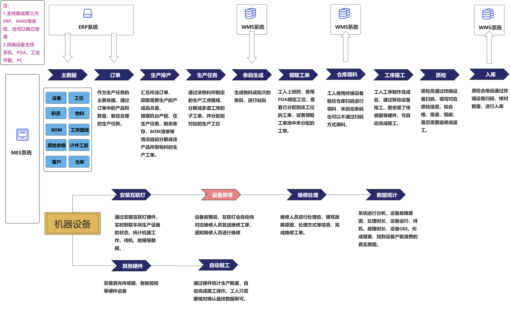

#### 系统架构

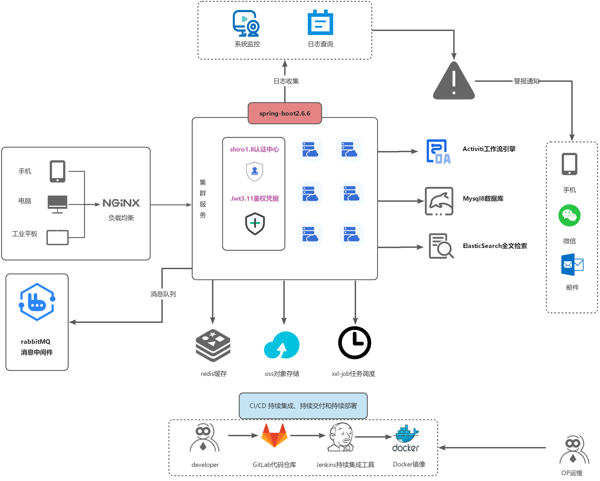

* 前端采用Vue、Element UI。
* 后端采用Spring Boot、Spring Security、Redis & Jwt。
* 权限认证使用Jwt，支持多终端认证系统。
* 高效率开发，使用代码生成器可以一键生成前后端代码。
*

特别鸣谢：[ruoyi-vue](https://gitee.com/y_project/RuoYi-Vue) ，[JimuReport](https://github.com/jeecgboot/JimuReport)，[element](https://gitee.com/link?target=https%3A%2F%2Fgithub.com%2FElemeFE%2Felement)，[vue-element-admin](https://gitee.com/link?target=https%3A%2F%2Fgithub.com%2FPanJiaChen%2Fvue-element-admin)，[eladmin-web](https://gitee.com/link?target=https%3A%2F%2Fgithub.com%2Felunez%2Feladmin-web)。

* 技术文档：待更新，可以先参考[若依框架](http://doc.ruoyi.vip/ruoyi-vue/)。
* 移动端仓库：[yjh-mes-uniapp](https://gitee.com/Jintiago/yjh-mes-uniapp)

## 🎑 演示环境

演示环境：http://mes.sourceplan.cn/index

账号：admin

密码：admin123 请勿修改密码

移动端安装包：将项目Stars后截屏发给微信【**jinzhong373**】获取。

## 🎯 演示图

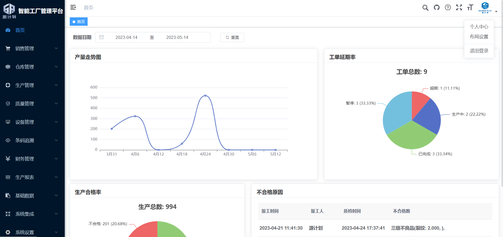

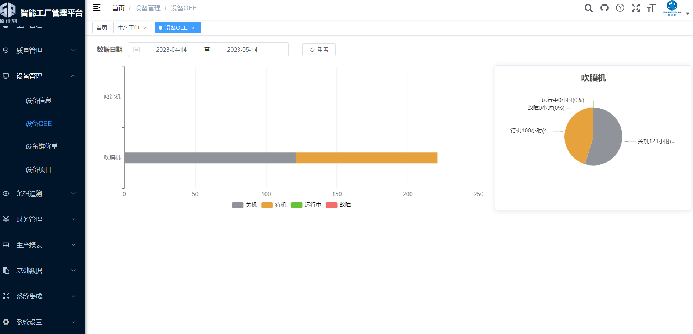

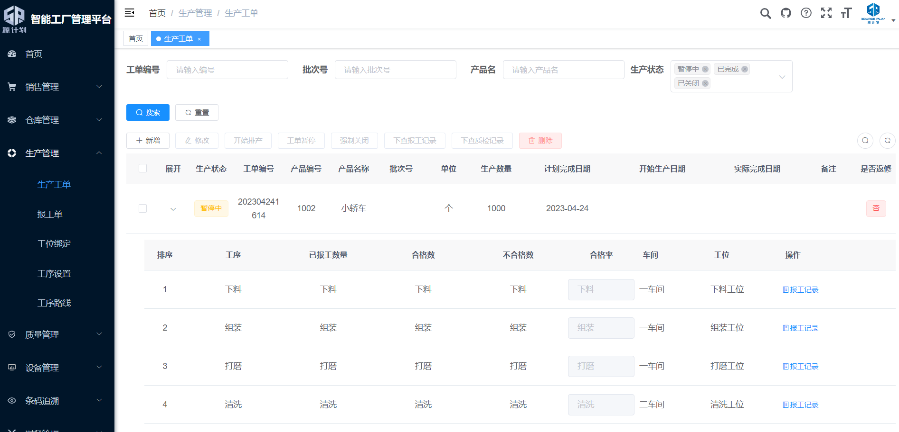

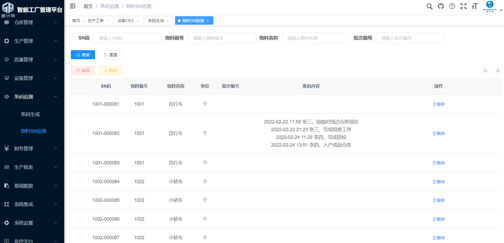

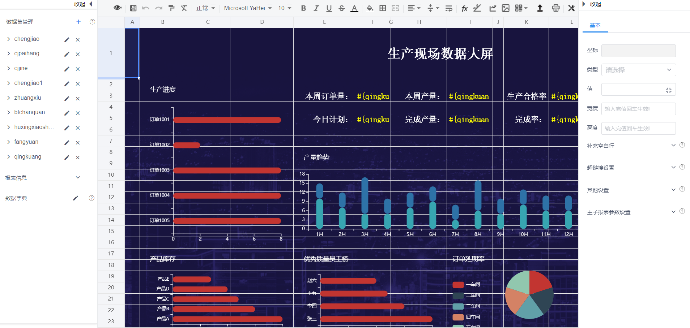

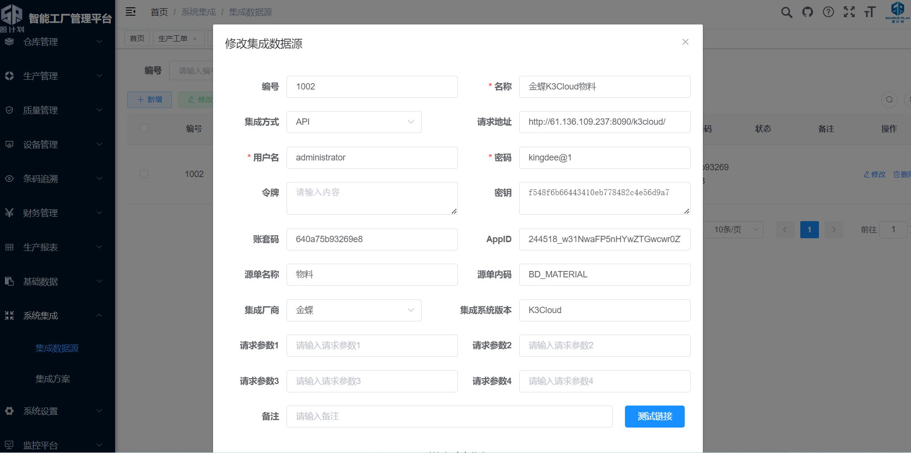

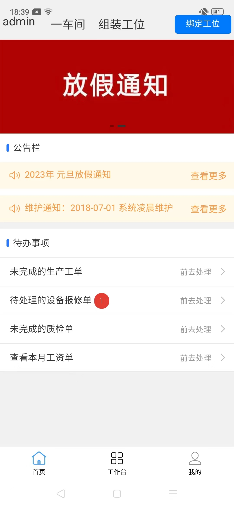     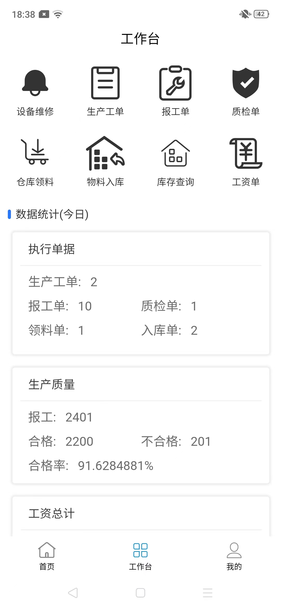     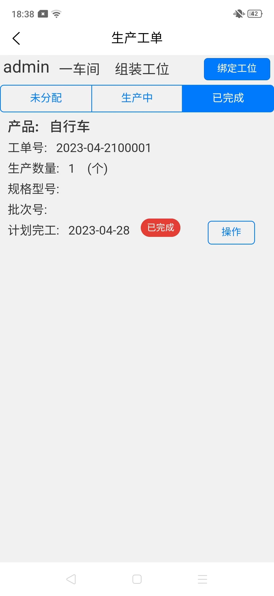  

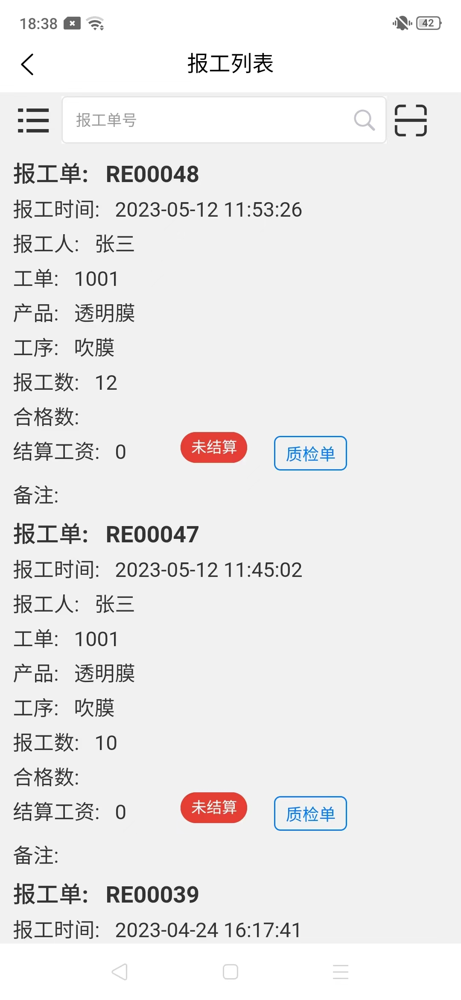     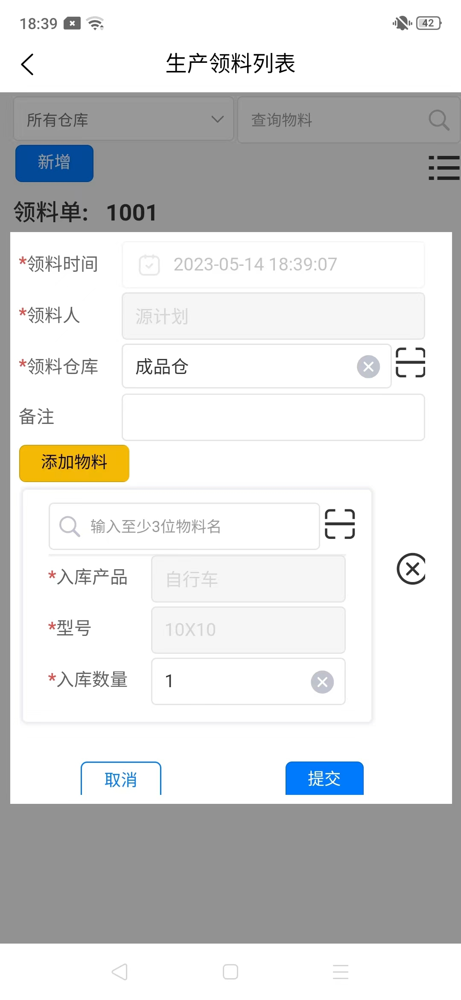     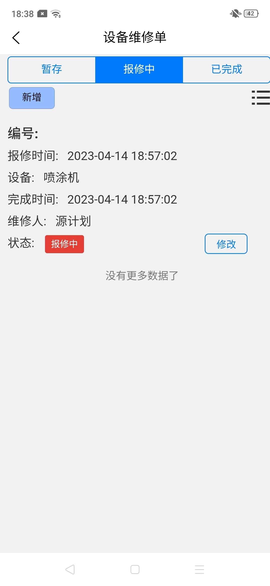  

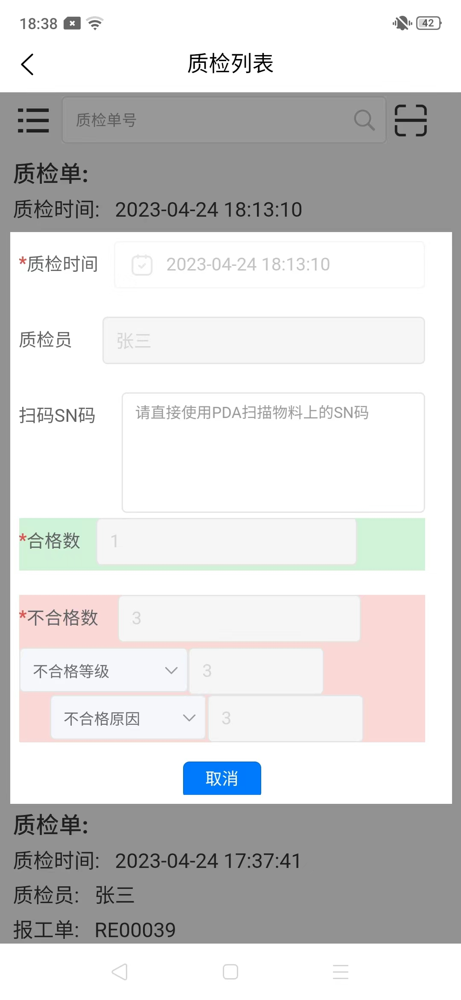 

## 🤝 商业服务

提供商业服务：
部署安装；软件实施；二次开发；

可以微信联系【**jinzhong373**】。

